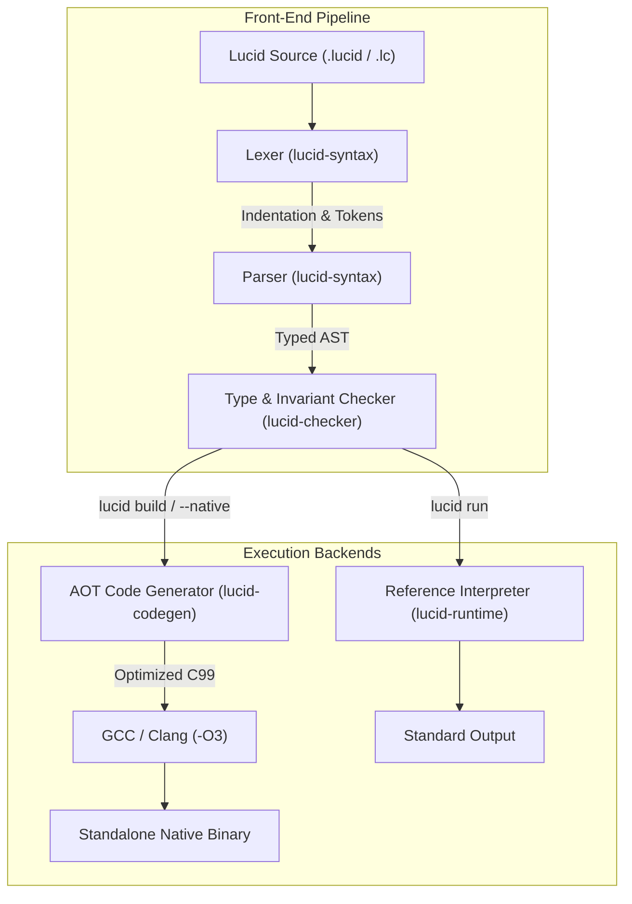

# Lucid Architecture: Compiler, Runtime, and Execution Pipeline

Lucid is a statically-typed language combining Python's syntax elegance with compile-time type safety, Julia-style multiple dispatch, explicit mutability views, and result-based error handling.

This document describes how Lucid works internally: its compilation pipeline, static checking guarantees, native AOT code generation, reference interpreter, and memory layout.

---

## 1. System Overview

Lucid provides **two execution engines** built on top of a shared parser and static type checker:

1. **Ahead-of-Time (AOT) Native Compiler (`lucid-codegen`)**: Generates optimized C99 machine code compiled with GCC/Clang (`-O3`), utilizing unboxed 64-bit hardware registers, hardware call stacks, and flat contiguous memory buffers. Achieves a **13.7x geometric mean speedup over CPython 3.14** across benchmark workloads.
2. **Reference Tree-Walking Interpreter (`lucid-runtime`)**: A dynamic evaluation engine and REPL with zero external compiler dependencies, ideal for rapid prototyping, interactive debugging, and language specification testing.



---

## 2. Workspace Crate Architecture

The compiler and toolchain are implemented in Rust within `compiler/crates/`:

| Crate | Responsibility | Key Structures / APIs |
| :--- | :--- | :--- |
| [`lucid-syntax`](compiler/crates/lucid-syntax) | Lexical analysis, indentation tracking, recursive descent parsing | `Lexer`, `Parser`, `ast::Module`, `ast::Stmt`, `ast::Expr` |
| [`lucid-checker`](compiler/crates/lucid-checker) | Bidirectional type inference, trait resolution, pattern exhaustiveness, mutability views | `TypeChecker`, `Type`, `Mutability`, `ClassDef`, `InterfaceDef` |
| [`lucid-codegen`](compiler/crates/lucid-codegen) | Native C99 code generation, register allocation, contiguous memory buffers | `CodeGen`, `emit_c()`, unboxed `int64_t`/`double` mapping |
| [`lucid-runtime`](compiler/crates/lucid-runtime) | Dynamic evaluation, environment frames, multiple dispatch, built-in functions | `Evaluator`, `Environment`, `Value`, `NativeFunction` |
| [`lucid-cli`](compiler/crates/lucid-cli) | Unified command-line interface, REPL driver, build runner | `lucid build`, `lucid run`, `lucid check`, `lucid repl` |

---

## 3. Pipeline Stages

### Stage 1: Lexical Analysis & Indentation Tracking
The lexer transforms source UTF-8 characters into a token stream. It tracks column position and maintains an internal stack of active indentation levels:
- When indentation increases, it pushes the new depth and emits an `Indent` token.
- When indentation decreases, it pops matching depths and emits `Dedent` tokens.
- Invalid indentation that does not align with any enclosing level produces an immediate syntax error.

### Stage 2: Syntactic Parsing & AST Construction
The parser uses recursive descent with precedence climbing for binary operators. It translates tokens into a strongly-typed AST preserving language invariants:
- **Three user-defined types**: Distinct AST representations for `interface` (pure obligations), `trait` (stateless reusable behavior), and `class` (owned fields and single inheritance).
- **Mutability views**: Explicit type annotations for mutable references (`T`), read-only views (`&T`), and deeply immutable instances (`!T`).
- **Multiple dispatch**: `dispatch def` syntax declaring symmetric multimethods.
- **Result propagation**: Postfix `?` operator for early error propagation without exception unwinding.

### Stage 3: Static Analysis & Invariant Checking
Before any execution or code generation, `lucid-checker` validates language guarantees:
- **Single inheritance**: Classes may inherit from at most one parent class. Multiple inheritance is rejected at compile time.
- **Interface fulfillment**: Verifies that implementing classes provide exact signatures for all interface obligations.
- **Trait composition**: Resolves trait method inheritance and ensures trait bodies do not attempt to define owned fields.
- **Pattern exhaustiveness**: Exhaustively validates `match` branches across union types and variant shapes.
- **Mutability permission enforcement**: Rejects attribute assignments when mutating through a read-only view (`&T`) or on a deeply immutable object (`!T`).

### Stage 4: Execution Backends

#### A. Ahead-of-Time Native Compiler (`lucid-codegen`)
Invoked via `lucid build <file> -o <bin>` or `lucid run --native <file>`:
1. Translates the type-annotated AST into clean, standard C99.
2. Unboxes primitive types (`Int` $\rightarrow$ `int64_t`, `Float` $\rightarrow$ `double`, `Bool` $\rightarrow$ `bool`), allocating them directly in CPU machine registers or stack slots.
3. Allocates fixed-size and dynamic arrays into flat, contiguous memory buffers (`malloc(n * sizeof(T))`), avoiding pointer indirections and heap boxing.
4. Generates standard C function calling conventions (`call`/`ret`), enabling CPU instruction pipelines to optimize recursion and loop vectorization.
5. Compiles with `gcc -O3 -fomit-frame-pointer -lm` to output a standalone machine binary.

#### B. Reference Tree-Walking Interpreter (`lucid-runtime`)
Invoked via `lucid run <file>` or `lucid repl`:
1. Evaluates AST expressions directly via tree walking.
2. Represents values using a tagged enum (`Value::Int`, `Value::Float`, `Value::ClassInstance`, etc.).
3. Manages lexical scopes using linked `Environment` frames.
4. Executes with zero external build dependencies, providing rapid turnaround for tests, REPL sessions, and spec verification.

---

## 4. Performance Architecture: Why Lucid Native is Fast

Across 10 standard benchmarks adapted from the Computer Language Benchmarks Game (Debian/Ubuntu Shootout), Lucid Native achieves a **13.7x geometric mean speedup over CPython 3.14**:

| Benchmark | CPython 3.14 (s) | Lucid Native (s) | Speedup | Architectural Rationale |
| :--- | :--- | :--- | :--- | :--- |
| **Spectral Norm** | 2.502s | 0.062s | **40.3x** | Flat contiguous memory buffers & SIMD loop vectorization |
| **Fibonacci (r)** | 0.840s | 0.023s | **36.5x** | Hardware CPU stack frames with zero interpreter frame overhead |
| **Mandelbrot** | 2.531s | 0.139s | **18.2x** | Unboxed 64-bit IEEE floating-point registers |
| **Fannkuch-Redux** | 0.655s | 0.038s | **17.2x** | In-place unboxed integer array permutations |
| **N-Body** | 0.940s | 0.076s | **12.4x** | Unboxed vector mathematics and coordinate transforms |
| **Sieve of Eratosthenes** | 0.812s | 0.077s | **10.5x** | Continuous boolean memory scans with cache locality |
| **Binary Trees** | 1.834s | 0.231s | **7.9x** | Compact struct allocations and fast pointer traversals |

For detailed timing tables and instructions to reproduce, see [BENCHMARKS.md](BENCHMARKS.md).

---

## 5. Command-Line Reference

```bash
# Compile to a native binary
lucid build program.lucid -o program
./program

# Run natively with immediate compilation
lucid run --native program.lucid

# Run with the reference tree-walking interpreter
lucid run program.lucid

# Verify types and static invariants without compiling
lucid check program.lucid

# Inspect generated C99 code
lucid emit-c program.lucid

# Start interactive REPL
lucid repl

# Run specification tests against documentation
cargo test --workspace
lucid test-spec docs/
```

---

## 6. Specification & Further Reading

- [Compiler and Runtime Architecture (RST)](docs/architecture.rst) — Full architecture document adhering to repository specification standards.
- [Language Principles](docs/principles.rst) — Core philosophy, zero-deprecation model, and design trade-offs.
- [Type Specification Overview](docs/type-specification.rst) — Rationale for separating interfaces, traits, and classes.
- [Benchmark Results & Methodology](BENCHMARKS.md) — Benchmark problem descriptions, timing methodology, and equivalence tests.
